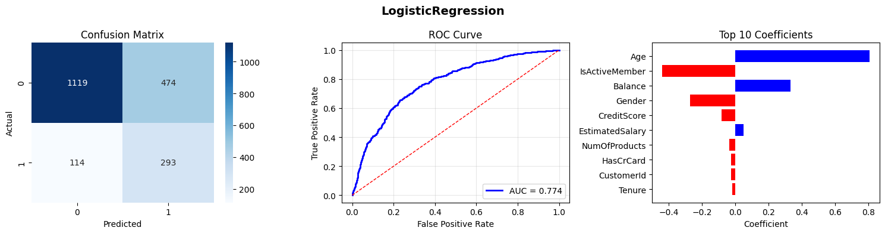
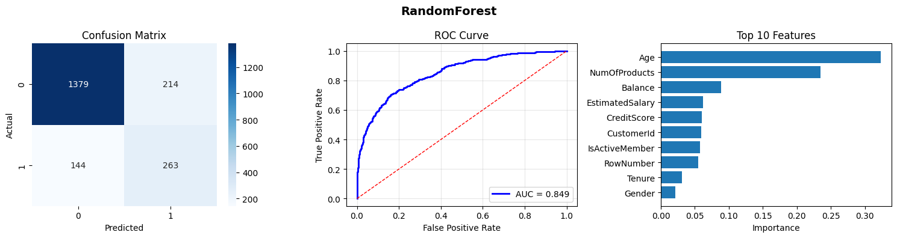
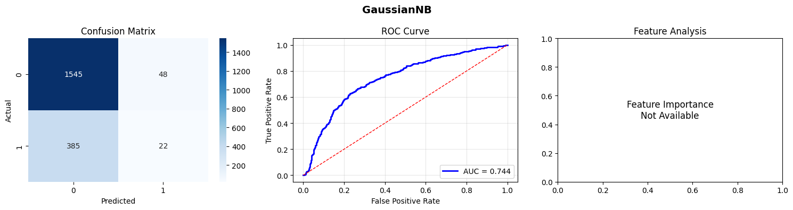
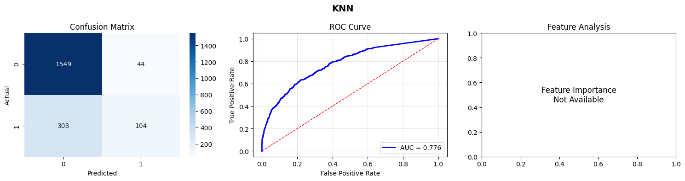
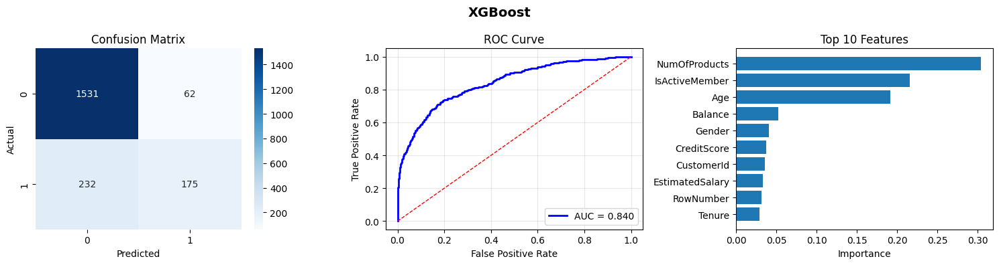
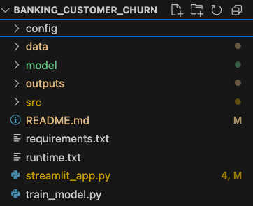
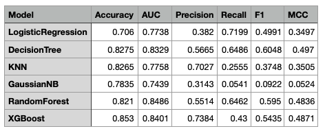

# Banking_Customer_Churn

## Step 1 : Dataset choice
a. Bank Customer Churn Dataset
- The dataset contains information about bank customers and whether they have Exited (i.e., closed their accounts) or not.
     Feature Size: 12
     Records: 10000

## Step 2 : Evaluation Metric

  ### "Model": "LogisticRegression",
  - "Accuracy": 0.706,
  - "Precision": 0.3820078226857888,
  - "Recall": 0.7199017199017199,
  - "F1": 0.4991482112436116,
  - "MCC": 0.34970214776872216,
  - "AUC": 0.7737706890249264,
  

  ### "Model": "RandomForestClassifier",
  - "Accuracy": 0.821,
  - "Precision": 0.5513626834381551,
  - "Recall": 0.6461916461916462,
  - "F1": 0.5950226244343891,
  - "MCC": 0.4835506638092883,
  - "AUC": 0.8486174926852892,
  

  ### "Model": "DecisionTreeClassifier",
  - "Accuracy": 0.8275,
  - "Precision": 0.5665236051502146,
  - "Recall": 0.6486486486486487,
  - "F1": 0.6048109965635738,
  - "MCC": 0.49698129922639683,
  - "AUC": 0.8329446549785534,
    

    ### "Model": "GaussianNB",
    - "Accuracy": 0.7835,
    - "Precision": 0.3142857142857143,
    - "Recall": 0.05405405405405406,
    - "F1": 0.09224318658280922,
    - "MCC": 0.052405760867435834,
    - "AUC": 0.7439334557978626,
    

    ### "Model": "KNN   ",
    - "Accuracy": 0.8265,
    - "Precision": 0.7027027027027027,
    - "Recall": 0.25552825552825553,
    - "F1": 0.3747747747747748,
    - "MCC": 0.3505195113984483,
    - "AUC": 0.7757989113921318,
    

    ### "Model": "XGBoost",
    - "Accuracy": 0.853,
    - "Precision": 0.7383966244725738,
    - "Recall": 0.42997542997543,
    - "F1": 0.5434782608695652,
    - "MCC": 0.4871276453473892,
    - "AUC": 0.8401267214826538,
    

    ## Step 3 : GitHub Repository Link

## Step 4 : Requirements.txt file
    

        scikit-learn
        matplotlib
        seaborn
        joblib
        pandas
        numpy
        xgboost
        PyYAML
        plotly

        graphviz

        xgboost

        streamlit==1.32.2
        altair==4.2.2

### Step 5 : 
- Problem Statement : Predicting Customer Churn in Banking Sector using Machine Learning Classification Algorithms.
- Dataset Description : The dataset contains information about bank customers and whether they have Exited (i.e., closed their accounts) or not. It includes features such as credit score, geography, gender, age, tenure, balance, number of products, credit card ownership, active membership status, and estimated salary.
- Evaluation Metric : Accuracy, Precision, Recall, F1-Score, Matthews Correlation Coefficient (MCC), Area Under the Curve (AUC)
- Model Used:
  1. Logistic Regression
  2. Random Forest Classifier
  3. Decision Tree Classifier
  4. Gaussian Naive Bayes
  5. K-Nearest Neighbors (KNN)
  6. XGBoost Classifier

  

### Conclusion : 
  After evaluating multiple machine learning classification algorithms on the Bank Customer Churn dataset, we found that the XGBoost Classifier outperformed other models in terms of accuracy and overall performance metrics. The XGBoost model achieved an accuracy of 85.3%, precision of 73.84%, recall of 42.99%, F1-score of 54.35%, MCC of 0.487, and AUC of 0.840. This indicates that XGBoost is particularly effective in predicting customer churn in the banking sector.

  The Random Forest Classifier and Decision Tree Classifier also showed strong performance, with accuracies of 82.1% and 82.75% respectively. However, they lagged behind XGBoost in terms of precision and F1-score.

  On the other hand, models like Gaussian Naive Bayes and K-Nearest Neighbors (KNN) demonstrated lower performance metrics, indicating that they may not be as suitable for this specific classification task.

  In conclusion, for predicting customer churn in the banking sector, ensemble methods like XGBoost are recommended due to their superior ability to handle complex patterns in the data and provide robust predictions. Future work could involve hyperparameter tuning and exploring additional features to further enhance model performance.

  ### Model-wise Performance Observations

| ML Model Name | Observation about Model Performance |
|--------------|-------------------------------------|
| **Logistic Regression** | Logistic Regression achieved moderate accuracy (70.6%) but recorded the highest recall (71.99%), indicating strong capability in identifying churned customers. However, its low precision (38.2%) suggests a higher number of false positives, making it suitable when recall is prioritized over precision. |
| **Decision Tree** | The Decision Tree model showed good overall accuracy (82.75%) with a balanced precision and recall. While it captured non-linear relationships better than linear models, its performance was slightly inferior to ensemble methods, possibly due to overfitting. |
| **KNN** | K-Nearest Neighbors achieved high precision (70.27%) but very low recall (25.55%), indicating that it failed to correctly identify many churned customers. This suggests that KNN is overly conservative and less suitable for churn prediction where recall is important. |
| **Naive Bayes** | Gaussian Naive Bayes recorded lower accuracy (78.35%) and the lowest F1-score (9.22%). Its strong feature independence assumption does not hold well for banking data, leading to poor predictive performance. |
| **Random Forest (Ensemble)** | Random Forest delivered strong and consistent performance across all metrics, achieving 82.1% accuracy, a high F1-score (59.5%), and a robust MCC (0.4836). As an ensemble method, it effectively reduced overfitting and captured complex feature interactions. |
| **XGBoost (Ensemble)** | XGBoost outperformed all other models with the highest accuracy (85.3%), precision (73.84%), MCC (0.4871), and a strong AUC (0.840). Its gradient boosting approach enabled superior handling of class imbalance and complex patterns, making it the most suitable model for this dataset. |
